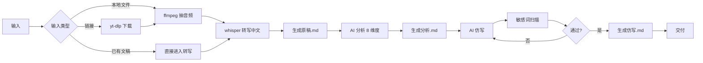

# 抖音逐字稿仿写 Skill

[](LICENSE)
[](CHANGELOG.md)
[](https://www.workbuddy.cn/)
[](https://www.python.org/)
[](CONTRIBUTING.md)

> 从抖音视频链接或本地视频文件，自动下载、提取口播文案、分析视频特点、仿写一篇亲和力强且通过抖音敏感词检测的口播逐字稿，一站式产出可直接发布的三份标准文件（**原稿 / 分析 / 仿写**）。

---

## ✨ 核心特性

- 🔗 **多源输入**：支持抖音分享链接、本地视频文件、用户粘贴的口播文稿
- 🎯 **中文识别**：内置中文语音模型（whisper.cpp / faster-whisper）
- 📊 **结构化分析**：8 个维度拆解原视频的爆款基因
- ✍️ **AI 仿写**：复刻节奏、口吻、钩子结构，生成新文案
- 🛡️ **敏感词拦截**：10 维度扫描（涉政/涉黄/违禁/广告法/医疗夸大/未成年/低俗/暴恐/隐私/版权），不过不放行
- 📦 **标准交付**：3 份 Markdown 模板（原稿/分析/仿写），复制即可发布

## 🚀 快速开始

### 方式 1：上传到 WorkBuddy 开放平台

1. 登录 [workbuddy.cn](https://www.workbuddy.cn/) → 技能 → 添加技能
2. 导入 [`douyin-transcript-imitation-skill.zip`](../../releases)（或在 WorkBuddy 平台打包后下载）
3. 在任意 AI 对话窗口用自然语言触发：

```text
@douyin-transcript-imitation
帮我仿写这条抖音：https://v.douyin.com/xxx
```

### 方式 2：本地 WorkBuddy 客户端加载

```bash
# 1. 克隆仓库
git clone https://github.com/your-username/douyin-transcript-imitation-skill.git

# 2. 复制到 WorkBuddy 客户端 skill 目录
#    Windows: %APPDATA%\WorkBuddy\skills\
#    macOS:   ~/Library/Application Support/WorkBuddy/skills/
cp -r douyin-transcript-imitation-skill <你的 WorkBuddy skills 目录>

# 3. 重启 WorkBuddy，AI 自动按需触发
```

### 方式 3：作为 Python 工具直接调用

```bash
# 安装依赖
pip install pyyaml

# 校验 SKILL.md 完整性
python scripts/validate_skill.py SKILL.md

# 敏感词扫描
python scripts/sensitive_check.py "你的文案内容"
```

## 📂 目录结构

```
douyin-transcript-imitation-skill/
├── .github/                    # GitHub 社区配置
│   ├── workflows/validate.yml  # CI: 校验 SKILL.md 格式
│   ├── ISSUE_TEMPLATE/         # Issue 模板
│   └── PULL_REQUEST_TEMPLATE.md
├── docs/                       # 详细文档
│   ├── installation.md
│   ├── usage.md
│   ├── architecture.md
│   └── troubleshooting.md
├── examples/                   # 输入/输出示例
│   ├── README.md
│   ├── sample-input-url.md
│   ├── sample-output-01-transcript.md
│   ├── sample-output-02-analysis.md
│   └── sample-output-03-imitation.md
├── references/                 # AI 按需查阅的参考文档
│   ├── expert-profile.md
│   ├── sensitive-word-categories.md
│   └── workflow-examples.md
├── scripts/                    # 可执行脚本
│   ├── sensitive_check.py     # 10 维度敏感词扫描
│   ├── setup_whisper.ps1      # whisper.cpp 一键部署
│   └── validate_skill.py      # SKILL.md frontmatter 校验
├── templates/                  # 输出文件模板
│   ├── transcript-template.md
│   ├── analysis-template.md
│   └── imitation-template.md
├── SKILL.md                    # 核心入口（WorkBuddy 识别用）
├── README.md                   # 本文件
├── LICENSE                     # MIT
├── CHANGELOG.md
├── CONTRIBUTING.md
├── CODE_OF_CONDUCT.md
├── SECURITY.md
├── CITATION.cff
└── .gitignore
```

## 🛠️ 工作流



## 🛡️ 敏感词检测（10 维度）

| 维度 | 覆盖范围 | 严重度 |
|------|----------|--------|
| 涉政 | 政治人物、敏感事件 | 🔴 致命 |
| 涉黄 | 性暗示、低俗 | 🔴 致命 |
| 违禁品 | 毒品、枪支、管制器具 | 🔴 致命 |
| 广告法 | 极限词、绝对化用语 | 🟡 警告 |
| 医疗夸大 | 治愈率、根治 | 🟡 警告 |
| 未成年 | 不良诱导 | 🔴 致命 |
| 低俗 | 脏话、贬损 | 🟡 警告 |
| 暴恐 | 暴力、恐怖 | 🔴 致命 |
| 隐私 | 身份证、手机号 | 🟠 隐私 |
| 版权 | 整段搬运、原歌词 | 🟠 版权 |

详见 [`references/sensitive-word-categories.md`](references/sensitive-word-categories.md)。

## 📊 8 维度爆款分析

每条原始视频会从以下 8 维度拆解，AI 在仿写阶段逐一对齐：

1. **钩子** —— 前 3 秒留人机制
2. **痛点** —— 戳中哪类人群
3. **节奏** —— 句长、断句、停顿
4. **口吻** —— 人称、情绪、年龄感
5. **金句** —— 记忆点句式
6. **结构** —— 总分总 / 故事 / 清单
7. **CTA** —— 关注/评论/购买引导
8. **BGM 与画面** —— 视听语言

## 🤝 贡献

欢迎 PR、Issue、Discussion。详见 [CONTRIBUTING.md](CONTRIBUTING.md)。

## 📜 许可证

本仓库采用 [MIT License](LICENSE) 开源。

## 🙏 致谢

- 灵感来源：[WorkBuddy 开放平台](https://www.workbuddy.cn/)
- 依赖工具：[yt-dlp](https://github.com/yt-dlp/yt-dlp)、[whisper.cpp](https://github.com/ggerganov/whisper.cpp)、[ffmpeg](https://ffmpeg.org/)

## 📮 联系方式

- Issue：[GitHub Issues](https://github.com/your-username/douyin-transcript-imitation-skill/issues)
- Discussions：[GitHub Discussions](https://github.com/your-username/douyin-transcript-imitation-skill/discussions)

---

⭐ 如果这个项目对你有帮助，欢迎点 Star！
