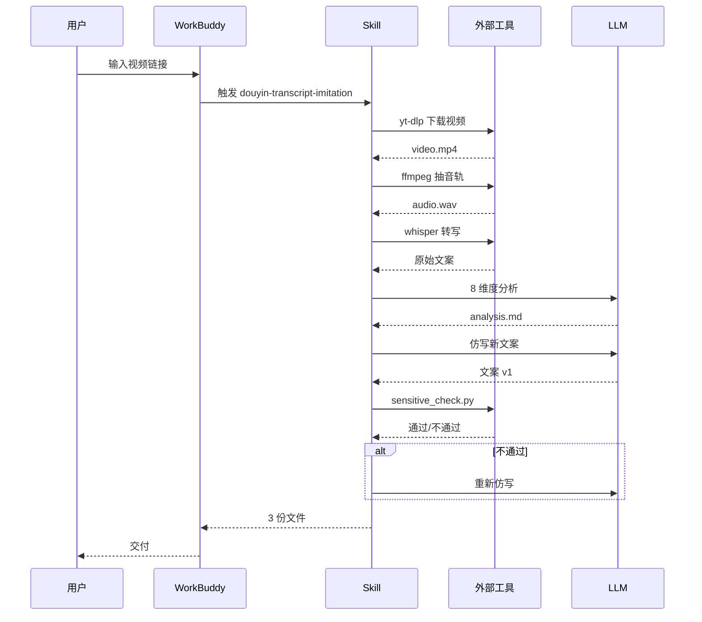

# 架构总览

本文档说明 Skill 的技术架构、数据流与可扩展点。

## 分层架构

```
┌────────────────────────────────────────────────────────────┐
│                    WorkBuddy 平台层                          │
│   (AI 对话窗口 + Skill 加载器 + 工具权限管理)                  │
└────────────────────────────────────────────────────────────┘
                              ↓
┌────────────────────────────────────────────────────────────┐
│                    SKILL 层 (本仓库)                         │
│  ┌──────────────┐  ┌──────────────┐  ┌──────────────┐    │
│  │ SKILL.md     │  │ references/  │  │ templates/   │    │
│  │ (入口+prompt)│  │ (知识库)      │  │ (输出标准)    │    │
│  └──────────────┘  └──────────────┘  └──────────────┘    │
│  ┌──────────────┐                                         │
│  │ scripts/     │  ← 可调用 Python 工具                    │
│  └──────────────┘                                         │
└────────────────────────────────────────────────────────────┘
                              ↓
┌────────────────────────────────────────────────────────────┐
│                    外部工具层                                │
│  ┌──────────┐ ┌──────────┐ ┌──────────┐ ┌──────────┐    │
│  │ yt-dlp   │ │ ffmpeg   │ │ whisper  │ │ sensitive│    │
│  │(下载)    │ │(转码)    │ │(ASR)     │ │_check.py │    │
│  └──────────┘ └──────────┘ └──────────┘ └──────────┘    │
└────────────────────────────────────────────────────────────┘
```

## 数据流



## 模块依赖

### SKILL.md（核心入口）

- WorkBuddy 启动时读取，识别 Skill 名称、描述、版本、权限
- 内含主 prompt，定义 AI 在被触发后的执行流程
- 必填字段：`name` / `display_name` / `description` / `version` / `category` / `author`

### references/（知识库）

AI 在执行过程中按需查阅的参考文档：

| 文件 | 何时被读 |
|------|----------|
| `expert-profile.md` | 触发瞬间，确立人设 |
| `sensitive-word-categories.md` | 仿写完成后，扫描前 |
| `workflow-examples.md` | 用户说"举个例子"时 |

> 💡 体积控制：references 总体不应超过 30KB，否则会拖慢首屏响应。

### templates/（输出模板）

保证交付物格式统一。AI 必须严格按模板填字段，否则用户用自动化脚本解析会失败。

### scripts/（可执行工具）

| 脚本 | 用途 | 调用方 |
|------|------|--------|
| `sensitive_check.py` | 10 维度敏感词扫描 | AI 仿写后自动调用 |
| `setup_whisper.ps1` | 部署 whisper.cpp | 用户首次使用 |
| `validate_skill.py` | 校验 frontmatter | CI / 开发期 |

## LLM 调用策略

为节省 token 与提升一致性，AI 在不同阶段使用不同 prompt：

| 阶段 | Prompt 大小 | 温度 | 备注 |
|------|-------------|------|------|
| 8 维度分析 | ~300 tokens | 0.3 | 要求结构化 |
| 仿写 | ~500 tokens | 0.8 | 创造性 |
| 敏感词扫描 | 0（直接脚本） | - | 规则匹配 |

## 扩展点

### 1. 添加新的输入平台

在 `references/workflow-examples.md` 加一个「小红书/B 站」的解析流程。
在 `SKILL.md` 的 prompt 里加一句：「如果是 X 平台链接，用 Y 工具」。

### 2. 添加新的输出模板

1. 在 `templates/` 加新模板文件
2. 在 `examples/` 加新示例
3. 在 `SKILL.md` 的 prompt 里加触发条件

### 3. 自定义敏感词维度

编辑 `scripts/sensitive_check.py` 的 `SENSITIVE_PATTERNS` 字典，添加新维度。

### 4. 多语种支持

替换 `setup_whisper.ps1` 里的模型为 `ggml-large.bin`，并在 `SKILL.md` 里说明支持的语种。

## 性能优化

| 瓶颈 | 优化手段 |
|------|----------|
| 视频下载慢 | 开启 yt-dlp 多线程 `--concurrent-fragments 4` |
| 转写慢 | 用 `tiny` 模型先粗转，再用 `small` 精修 |
| LLM 调用慢 | 用更小的 prompt，把分析维度从 8 砍到 5 |
| 文件 IO 慢 | 用 SSD，临时文件放 `/tmp` |

## 安全边界

详见 [SECURITY.md](../SECURITY.md)。核心原则：

1. **最小权限**：`allowed-tools` 只开必要工具
2. **白名单**：输入文件类型限定为 `.mp4` / `.mp3` / `.wav` / `.m4a`
3. **沙箱**：所有外部命令在隔离环境运行
4. **不持久化**：视频文件处理完即删

## 版本兼容

| Skill 版本 | WorkBuddy 版本 | 备注 |
|------------|---------------|------|
| 1.0.x | 1.0+ | 当前 |
| 0.x | 0.8+ | 旧版，不推荐 |
